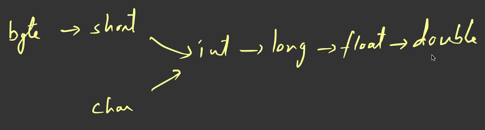
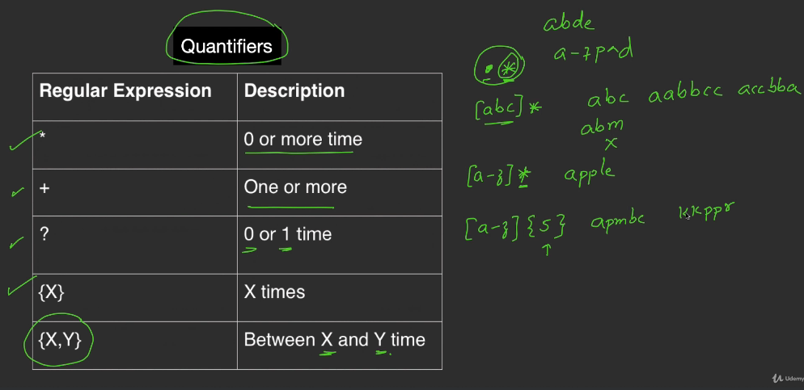
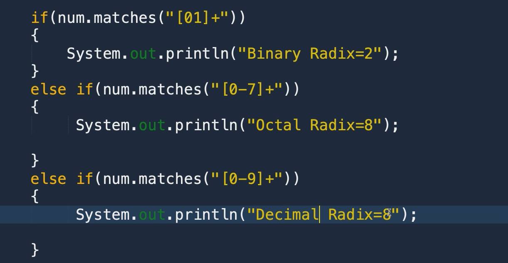
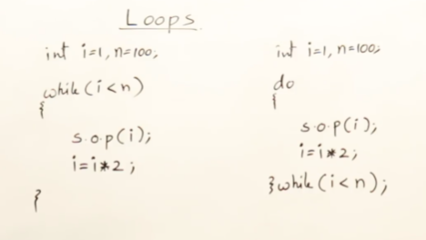
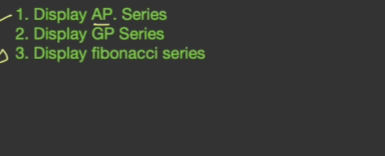
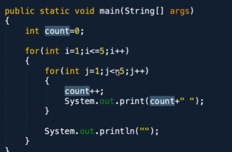
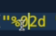

/**
 * The `javap` command is a utility provided by the Java Development Kit (JDK) that displays information about the members of a compiled Java class. 
 * In this case, the `javap` command is used to display information about the `Integer` class from the `java.lang` package.
 * 
 * The `Integer` class is a wrapper class for the primitive type `int` in Java. It provides various methods and constants for working with integer values.
 * By using the `javap` command with the `java.lang.Integer` class, you can see the details of its members, such as fields, constructors, and methods.
 * 
 * To use the `javap` command, you need to have the JDK installed on your system and set up the Java environment variables properly.
 * Once you have the JDK installed, you can open a command prompt or terminal and run the `javap` command followed by the fully qualified name of the class you want to inspect.
 * In this case, the command would be `javap java.lang.Integer`.
 * 
 * Running the `javap` command will display the details of the `Integer` class, including its fields, constructors, and methods, along with their signatures and modifiers.
 * This information can be useful for understanding how the `Integer` class is implemented and for exploring its available functionality.
 */
/**
 * This code snippet demonstrates the usage of the `javap` command to inspect the methods of the `java.lang.Integer` class.
 * The `javap` command is a command-line utility that displays information about the members of compiled Java classes.
 * In this case, it is used to display the methods available in the `Integer` class.
 */
Java is class based high level, object oriented programming language which is statically typed, both compiled and interpreted language and it follow's the write once run anywhere principle.

(java's byte code makes it platform independent and secure. java is the most popular programming language and it is used in the development of web applications, mobile applications, enterprise applications, and embedded systems.)

Java is high level, platform independent, object oriented, secure, robust, distributed, multi-threaded, portable, and dynamic language


# Introduction

## 1. Instruction Note

## 2. Download and Install JDK

For writing and developing java programs, we require JDK

JDK will have a compiler and runtime environment, which will help us write Java programs and execute them.

Along with the installation of JDK, we will get the JRE and JVM.

JDK means Java Development Kit which contains debugging tools, development tools(Javac, Java), and JRE

for executing java programs we requie jvm which is the part of JRE

we say java programs are executed in JRE, but actually, they are executed in JVM

### Installation

1. Go to the Oracle website and download the JDK
2. Install the JDK
3. Set the environment variables
preferred to set at the system variables
4. Verify the installation
cmd> java -version
cmd> javac -version

preferred version is LTS(Long Term Support) version
JAVA 8 is popular and widely used
(in the course java 13 or 14 is used)

File explorer> C:\Program Files\Java\jdk-14.0.1\bin
with java dir all the java versions will be installed


>dir    //to see the list of files in the directory
>md java  //to create a directory

```java
import java.lang.*;//importing the lang package happens by default
class Hello{
    public static void main(String[] args){
        System.out.println("Hello World");
    }
}
```

when you are writing the first code in notepad then recommeded to save the file with .java extension
 
//wrapp around double quotes


- to compile java program
>javac Hello.java
- to run java program
>java Hello

## 5. Skeleton of Java Program

lang is basic package and get's imported by default

class name should be same as the file name
inside the class, we can have multiple methods
main method is the entry point of the program

if your compiling and running the program from cmd


if you want to use anything from the class, then you need to create the object of the class.
if it is static then you can directly use it without creating the object of the class

JVM initially calls the main method of the class
First.main() 


in java there is nothing outside the class and object
System.out.println() is the method of the out object of the System class

## 6. Exploring the First Skeleton Program
System class is present in the lang package
out is the object of the PrintStream class
println is the method of the PrintStream class

when class is public then the file name should be same as the class name
when class is not public then the file name can be anything

<!-- read and understand the erros -->
<!-- IMP : FS, COLLECTION FW, MULTITHREADING, EXCEPTION HANDLING -->


## 7. Reading from Keyboard
java provides a class called scanner that is used for reading the input from different sources like keyboard, etc.

util is the built-in package in java, which contains the scanner class

```java
import java.util.Scanner;
class Hello{
    public static void main(String[] args){
        Scanner sc = new Scanner(System.in);
        System.out.println("Enter the number");
        int a = sc.nextInt();
        System.out.println("The number is "+a);
    }
}
```

class Scanner
- nextInt() : reads the integer
- nextFloat() : reads the float
- nextDouble() : reads the double
- next() : reads the string
- nextLine() : reads the line
- nextBoolean() : reads the boolean
- nextByte() : reads the byte
- nextShort() : reads the short
- nextLong() : reads the long

//before reading the input , you need to verify the data
- hasNextInt() : checks if the next token is an integer
- hasNextFloat() : checks if the next token is a float

//close the scanner resource
- close() : closes the scanner

## 8. Reading the scanner
System.out is the object attached to the console
System.in is the object attached to the keyboard

Scanner class is used to read the input from the keyboard

exception are the runtime errors which abruptly terminate the program need to be handled
```java
import java.util.*;

public class Main{
    public static void main(String args[]){
        Scanner sc = new Scanner(System.in);
        int a,b;
        System.out.println("Enter two number : ");
        a = sc.nextInt();
        b = sc.nextInt();
        System.out.println("sum is "+(a+b));
        sc.close();
    }
}
```

>javap java.util.Scanner

//is used to see the methods of the class

# Section 2: Data Types and Operators
## 10. Introduction to Data Types
Data types are used to define the type of data a variable can store
Date is the most important part of the program and ingredients of the program on which we perform the operations and do the processing

when program is running in the memory then the data of the program is hold by the variables

variables are meant for storing the data
variables has the type of data and the name of the variable

primitive data types are the basic data types and inbuilt data types of the java program 


depending the size of data that specific data type can be used.

java supports the unicode character set means it supports the international languages
char is 2 bytes and unicode format

float follows the IEEE 754 standard
double follows the IEEE 754 standard

float is able to store the long

## 11. check size and range of the data types
for primitive data types there are equivalent wrapper classes are available. In those classes there are some constants are available which are used to check the size and range of the data types

```java
class Main{
    public static void main(String args[]){
        System.out.println("Size of int : "+Integer.SIZE);
        System.out.println("Size of int : "+Integer.BYTES);
        System.out.println("Min value of int : "+Integer.MIN_VALUE);
        System.out.println("Max value of int : "+Integer.MAX_VALUE);
    }
}
```

>javap java.lang.Integer

during the execution of the program, the data is stored in the variables and the variables are stored in the memory

local variables must be initialized before using them
instances variables are initialized by default values
```java
class Main{
    int a; //instance variable
    public static void main(String args[]){
        int b; //local variable
        System.out.println(a);
        System.out.println(b);
    }
}
```
if float is given to int
then it will give the error
```java
class Main{
    public static void main(String args[]){
        float a = 10.2;
        int b = a;
        System.out.println(b);
    }
}
```

## 13. Rules for variable names
while developing the big programs, we need to follow the naming conventions and the rules for the variable names

1. variables are case sensitive
2. variables can start with the alphabet, underscore, and dollar sign
eg. int room_number, cabin151, _room, $room

3. after the first character, we can use the digits
4. we can't use the reserved keywords as the variable names
5. we can't use the special characters except the underscore and dollar sign
6. we can't use the spaces in the variable names
7. we can't use the length more than 255 characters
8. we can't use the same name for the class and the variable
9. we can't use the same name for the method and the variable

int String;
(above is allowed but not recommended)

camelCase is the recommended naming convention for the variables and the methods
eg. roomNumber, averageMarks, studentName, employeeSalary
PascalCase is the recommended naming convention for the classes
UPPERCASE is the recommended naming convention for the constants
eg. PI, MAX_VALUE, MIN_VALUE

sample variable names:
int rollNumber$Student; //allowed
int rollNumber_Student; //allowed
int rollNumber-Student; //not allowed
int rollNumber Student; //not allowed
int rollNumberStudent; //allowed (camelCase) //recommended
class Student{} //allowed (PascalCase) //recommended
final int PI = 3.14; //allowed (UPPERCASE) //recommended


## 15. Integra Data Types in Detail

olden days we have 16 and 32 bit systems

now modern days we have 64 bit systems

in a single shot how many bits are processed by the CPU is called the word size of the CPU
cycle = 1 bit processing by the CPU
in a single cycle, the CPU can process the data of the word size
word size is the number of bits processed by the CPU in a single cycle

java has short and byte to support the backward compatibility with olden languages like C , cobol, etc

byte takes 8 bits
in 7 bits what is the least value can be stored is -128
in 7 bits what is the max value can be stored is 127
7th bit is used for the sign


## 16. check binary bits of an integer
to see the binary bits of the integer we can use the wrapper class method toBinaryString()
```java
class Main{
    public static void main(String args[]){
        System.out.println(Integer.toBinaryString(10));
    }
}
```
other methods 
- toHexString()
- toOctalString()

## 17. Floating Point and Character in Detail
float and double are the floating-point data types
decimal point is not stored in the memory
then how the decimal point numbers are stored in the memory ?

represented in the scientific notation
it is represented in the mantissa and the exponent
upto 6-7 decimal places float is suitable
upto 15 decimal places double is suitable

ASCII is the 7 bit character set
A,B,C...Z (65,66,67...90)
a,b,c...z (97,98,99...122)
0,1,2,3,4,5,6,7,8,9 (48,49,50,51,52,53,54,55,56,57)
+, -, *, /, %, &, |, ^, ~, <<, >>, >>> (43,45,42,47,37,38,124,94,126,60,62,62,62)
Unicode is the 16 bit character set

boolean size is not defined in the java, it is JVM dependent

## visiting unicode.org
https://unicode.org/charts/
click the language you need
that are hexadecimal codes

//devangri
// class Main{
//     public static void main(String arg[]){
//         // char c = 0x03C8;

//         //greek language
//         for(char c =0x0900;c<=0x0970;c++)
//             System.out.print(c+" ");
//     }
// }

float f=35.6; it is invalid. 35.6 is a double literal. it should be float f=35.6f;

# Section 3: Setup Java Environment
## 19. Notepad++ Installation
## 20. Eclipse Installation
## 21. NetBeans Installation
## 22. IntelliJ IDEA Installation

# Section 4: Features and Architecture of Java
## 23. Compiler vs Interpreter
interpreter and compiler are used for translating our programs into the machine language and executing them

compiler translates the entire program at once and then executes the program

interpreter translates the program line by line and then executes the program

interpreter language are easy to debug and learn
compiler languages are fast and efficient and difficult to debug
java is both compiled and interpreted language

## 24 How java is platform independent
java is platform independent because of the JVM
java is platform independent because of the byte code

program makes the system calls to the OS.
in java the system calls are made by the JVM

JVM and byte code makes the java platform independent.

## 26. JVM Architecture
=> Class Loader Subsystem
=> Memory Area
=> Execution Engine (interpreter + JIT compiler)
=> Native Method Interface


literals are kept in the string pool

```java
String s1 = "hello";
String s2 = "hello";
String s3 = new String("hello");
```
cpu store the addresses of instruction for next instruction to execute


external


## 27 JVM architecture in Detail


{
Application class loader loads the classes (our classess) whatever we are using in our program

bootstrap class loader loads the classes which are present in the rt.jar file

extension class loader loads the classes which are present in the ext folder
}

{
Linking is the process of combining the code of the class with the code of the other classes
verify checks the byte code is valid or not (secure)
prepare allocates the memory for the static variables and initializes the default values
resolve replaces the symbolic references with the direct references (actual linking of the code happens here)
}

{
Intialization is the process of executing the static blocks and initializing the static variables
}

stack has multiple treads and each thread has its own stack and pc register has the address of the next instruction to execute

Interpreter reads the byte code and executes the instructions
JIT compiler compiles the byte code into the native code and then executes the native code
Garbage collector (execution engine) is the part of the memory area which is used to destroy the objects which are not in use

## 28. Java Features
1. Simple (syntax is similar to C and C++ and easy to learn and write the programs)
2. secure (java is secure because of the byte code and the JVM) (viruses can't be created in java)
3. Portable and platform independent (java is portable because of the byte code and the JVM)
4. Object Oriented (java is object oriented because of the classes and objects) (encapsulation, inheritance, polymorphism, abstraction)
5. Robust (java is robust because of the exception handling and the garbage collector)
6. Multithreaded (java is multithreaded because of the threads)
7. Architecture Neutral (Hardware and OS neutral)(java follows von neumann architecture)
8. Interpreted (java is interpreted because of the JVM)
9. High Performance (java is high performance because of the JIT compiler)
10. Distributed (java is distributed because of the RMI and EJB) (RMI is used for the remote method invocation and EJB is used for the enterprise java beans) (RMI and EJB are outdated) (spring framework is used in modern days and spring boot is used for the microservices)
11. Dynamic (java is dynamic because of the reflection and the class loader)


# Section 5: operators and expressions 
## 29.Arithmetic operators and expressions
Arithmetic operations can't be performed on the boolean data type
in java mod operator can be used for the float and double data types
```java
class Main{
    public static void main(String args[]){
        int a = 10;
        int b = 20;
        System.out.println(a+b);
        System.out.println(a-b);
        System.out.println(a*b);
        System.out.println(a/b);
        System.out.println(a%b);
    }
}
```

<!-- 
java 8 mention all topics below
lambda expression
functional interface
stream api
date and time api
default methods
static methods
method reference

Here are some of the key features introduced in Java 8:

Lambda Expressions and Functional Interfaces: Lambda expressions provide a concise way to write anonymous functions, while functional interfaces define the signature of these functions. This enables functional programming concepts like mapping, filtering, and reducing collections.

Stream API: The Stream API offers a powerful mechanism for processing collections in a declarative manner. It allows you to chain operations like filtering, mapping, and reduction on streams of elements, leading to more readable and concise code.

Default and Static Methods in Interfaces: Java 8 allows adding default and static methods to interfaces. Default methods provide a way to define default behavior for an interface, while static methods can contain utility functions.

Optional Class: The Optional class helps deal with null values in a more elegant and safer way. It provides methods to check for nullity, extract values, and handle null cases more effectively.

Java Date and Time API: This new API replaces the old and cumbersome java.util.Date class with a modern and intuitive API for working with dates, times, and timezones.

Collection API Improvements: Java 8 introduced several improvements to the Collection API, including methods like forEach for iterating over elements, and factory methods for creating collections more conveniently.

Other Improvements: Java 8 also introduced various other enhancements, including:

Base64 encoding and decoding support
Nashorn JavaScript engine for embedded scripting
Improvements to concurrency and IO APIs
These are some of the major features introduced in Java 8 that have significantly impacted Java development. They have made Java code more concise, readable, and expressive, enabling developers to write more functional and efficient programs.
 -->

**coercion** is the process of converting the data from one type to another type


(5*10/2) is the expression

### calculate the area of triangle

### quadratic equation

1 1 1 Nan
1 -4 4 2 2
1 5 6 -2 -3

INCREMENT AND DECREMENT OPERATORS


increment and decrement can be performed on characters
```java
class Main{
    public static void main(String args[]){
        char c = 'A';
        System.out.println(c);
        System.out.println(++c);
        System.out.println(c);
    }
}
```
when arithematic operations performed on byte the result will be int
when arithematic operations performed on short the result will be int


## 36. Bitwise Operator - AND, OR and XOR


Bitwise AND


Bitwise OR


Bitwise XOR


Bitwise Left Shift


Bitwise Right Shift


Bitwise unsigned Right Shift

NOTE : minior mistake in the above image


Bitwise NOT


## Merging and Masking
Merging means combining the bits of two numbers
Masking means extracting the bits of the number
MASKING | 


MERGING &


```java
class Main{
    public static void main(String args[]){
        int a = 0x0F;
        int b = 0x0A;
        System.out.println(a&b);
        System.out.println(a|b);
        System.out.println(a^b);
        System.out.println(~a);
        System.out.println(a<<2);
        System.out.println(a>>2);
        System.out.println(a>>>2);
    }
}
```

EG : SUPPOSE TO STORE THE 0 TO 10 NUMBER byte data type is enough 
can we able to store in less space (through masking and merging)
0 to 10 to store 4 bits are enough
storing 5 and 9 in 1 byte

like the below we can store


how to retrieve the 5 and 9 from the 1 byte by using &  


storing 2 numbers in single byte


## 41. Widening and Narrowing

Widening is the process of converting the data from the lower data type to the higher data type
Narrowing is the process of converting the data from the higher data type to the lower data type

character we can assign char and int




# Section 6: Strings
String
StringBuffer
StringBuilder

out is the static object of the PrintStream class
Method with same name and different parameter list = method overloading
print() is overloaded method


order of taking arguments


### Format Specifier


float width and precesion


## 45. String Object

String is a builtin class available in the java.lang package and it is immutable. used like a data type.

String is a collection of characters.

String str1 = "Java Programming"; //String literal
                //string object


char c[] = {'a','b','c','d'};
String s = new String(c);
//converted to string

byte b[] = {65,66,67,68};
String s1 = new String(b);
//converted to string0

String s2 = new String("Java Programming"); // 2 objects are created

String s3 = "Java Programming";
//string literal is created in the string pool

java mains the string pool for the string literals

>javap java.lang.String

compare the references
String str1 = "Java";
String str2 = "Java";
String str3 = new String("Java");
String str4 = new String("Java");
System.out.println(str1==str2); //true
System.out.println(str1==str3); //false
System.out.println(str3==str4); //false

## 47. String Methods#1


.toUpperCase() won't changes the original string
new string object is created and reference is changed.

## 53.Regular Expressions




---


---


----


find number of words


# Section 7 Control Statements
## 58.Relational and logical operators

all this returns boolean value

## 59. if else statement


https://www.codingninjas.com/studio/library/leap-year-program-in-java

https://www.geeksforgeeks.org/java-program-to-find-if-a-given-year-is-a-leap-year/



switch case


CAREFULL STUDY


quiz


# Section 8: LoopS
GCD, HCF and LCM 


(pre test loop)
while loop executes as long as the condition is true

do while is (post test loop)
do while loop executes atleast once and then checks the condition





while(true){
    //infinite loop
}
System.out.println("Hello");
//unreachable code //compilation error

if(true){
    System.out.println("Hello");
}
else{
System.out.println("Bye");
}// unreachable code 
//compilation warning.

for loop is the counter controlled loop


print in reverse order

## 72.sc : Factorial  


1.

2.

3.


---

## 73.Armstrong
== sum of the cubes of the digits of the number is equal to the number itself


1.


2.


3.


## 74. sc : palindrome number

4.


5.


## 75.


use switch case 

CODE


(usage : above code is use full in certificates)

## 76.

1.
ap = starting term and common difference


2.


## 77. Nested Loops


---

---


---


---





## 79. 

---

---

---

---

---

---

quiz


# Section 9: Arrays

## 81. 1D array
== collection of similar data elements


//eg. x = [5,2,1,4,3]

int a[] = new int[5];
a[] = {5,2,1,4,3}
- every array in java is an object and every array object is created in the heap memory
a[] = is the reference
int[5] = is the array object

- size of the array is fixed
property
System.out.println(a.length);

arr[5] = {5,2,1,4,3};

- array index starts from 0
- array index ends at n-1
- array index can be positive and negative
- array index can be int and char


### for each loop
for(int x:arr){
    System.out.println(x);
}

we can only access in the forward direction only.

for each loop doesn't have index

array is mutable
values can be incremented using the counter controlled loop


1.

2.


4.


## 84.

1. left rotation

try right rotation


inserting an element in middle or given index


code for the below diagrams


array of ref
array of elems


ref's of 2d and 

and declaration


## 88. sc : matrix mul


---


---
mul


CODE

first check with identity matrix

inbuilt sort


# Section 10: Methods

=methods are the members of the classes, which provides the functionality for the class.

methods/subroutines/functions

- skeleton of method


int max(int x, int y){
    if(x>y){
        return x;
    }
    else{
        return y;
    }
}


respective parameter are copied 


actual parameter and formal parameters

(pass by value and pass by reference)

static methods can call only static method
it can't call non static methods

CALL BY VALUE
value of actual parameter will not be modified by the formal parameter


## 91. Passing Obj as the parameter.


eg.


## 93.


## 94. sc : find prime number


---


Algorithm for gcd


## 95.


methods having same name and different parameter list( Order of the parameters, type of the parameters, number of parameters)


incompatible type possible loss of conversion


name is same, but method call is different this is know as false polymorphism (behaviour is different, based on the parameters)
return type is not considered for the method overloading

## 97. SC : overload validate method


3.


**variable arguments**
## 98.


printf uses the ellipse in c

