/408
13

# Title : [NEW] Master Spring Boot 3 & Spring Framework 6 with Java


>About this course
Become **Java SpringBoot Full Stack Cloud Developer**. 
Learn **AWS, React, Docker, Spring Data JPA & Spring Security.**

# Sec 1 : instruction - how to follow the course
Instructions
# Sec 2 : Getting Started with Spring Framework

## 7.CODE BACKUP and STEP BY STEP CHANGES : For Coding Reference and Debugging
I'm really delighted to have the privilege of being your instructor for this course! I welcome you to another awesome section!


👉 Bookmark the GitHub folder for this section

https://github.com/in28minutes/master-spring-and-spring-boot/tree/main/01-spring


👉 Help for Debugging Problems

Here's the code backup at the end of step 05: https://github.com/in28minutes/master-spring-and-spring-boot/blob/main/01-spring/01-Step05.md

Step by Step changes are detailed here: https://github.com/in28minutes/master-spring-and-spring-boot/blob/main/01-spring/step-by-step-code-changes/step-by-step-guide.md


I will see you in the next lecture.


Happy Learning,

Ranga


## 8.
Web Apps
REST API
FULL STACK
Microservices

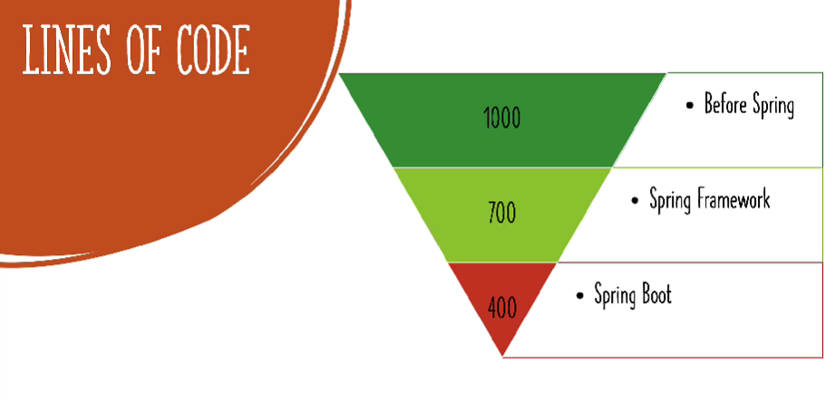

## 9. Maximize with speed learning 


## 10. Getting started with SpringFW

## 11. step 03 crating anew spring FW project with mavan and java
https://start.spring.io/
don't use snapshot version of spring boot that are meant for development and testing (currently being developed by the spring team)
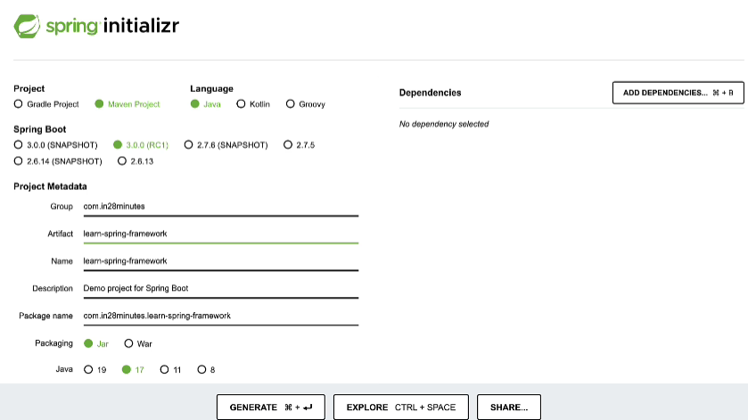


select the downloaded and extracted folder.

## 12. step04 : Getting started with the java gaming application

mairo game classes
everything is tightly coupled
**Tightly Coupled** : when one class is dependent on another class, it is called tightly coupled

## 13. step 05 : understand the tight coupling and loose coupling
MainGameApplication
marioGame
superContraGame
GameRunner
**understand the tight coupling and loose coupling with the above example**

## 14 
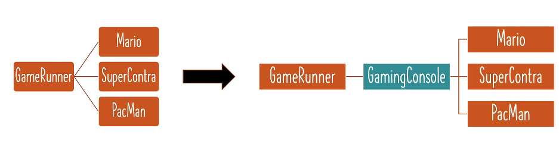
iteration 2 : Loose coupling with interface
AppGamingBasic.java (main class)
MarioGame.java
SuperContraGame.java
GameRunner.java (dont need to make any changes)
GamingConsole.java (interface)
GameRunner -> GamingConsole -> MarioGame , SuperContraGame , PacManGame
interface is something which represents the common actions that can be performed on a specific set of classes.

## 15 bringing spfw to make java app for loose coupling

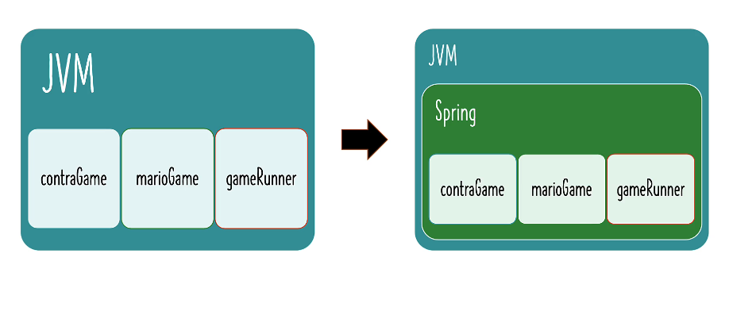

## 16 first spring bean and launch fw
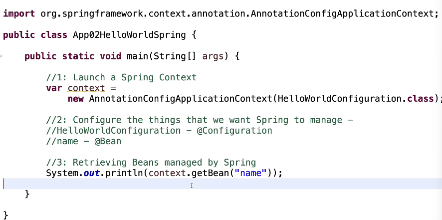

## 17 creating more java spring beans in spring java configuration file.


## 18
attribute to @Bean

## 19
BeanFactory is used for some kind of an IoT application.
where severly contrained for memory

## 22 Step 13 - Exploring Java Bean vs POJO vs Spring Bean
java bean vs spring bean vs pojo
plain old java object.

POJO =Any Java object is a pojo,
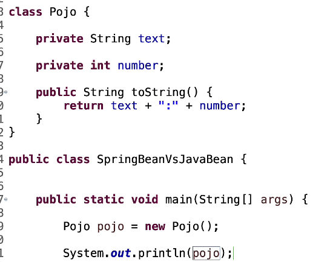

EJB introducted the Java bean.
java bean should have
1. public no-arg constructor
2. getters and setters
3. implements serializable interface
then an instance of a class is called a java bean

## 23  Exploring Spring Framework Bean Auto Wiring - Primary & Qualifier

//functional programming
Arrays.steam()
context.getBeanDEfinitionNames()).foreach(System.out::println);

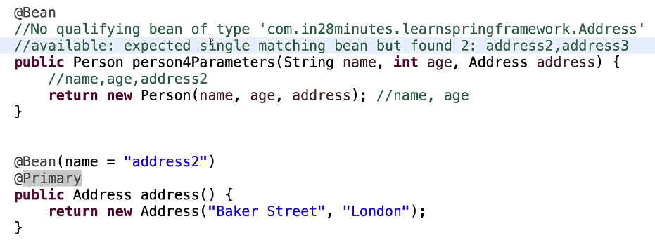

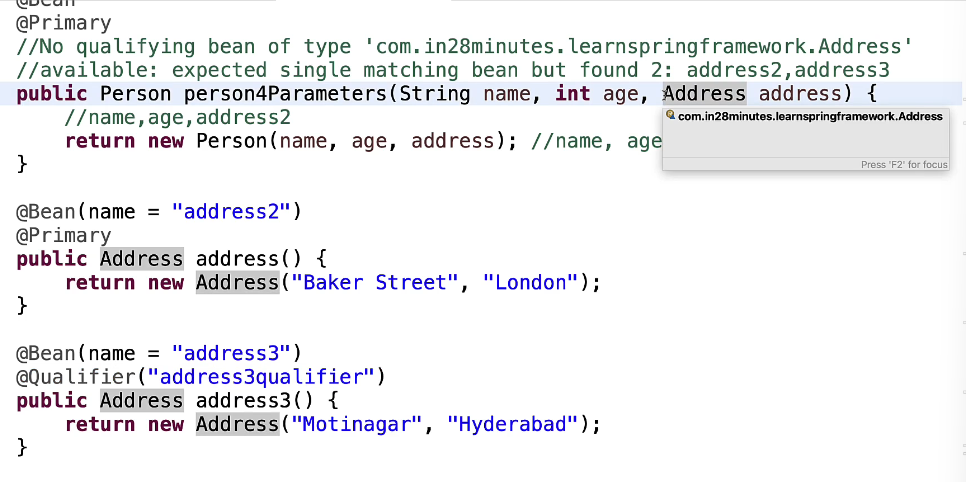

autowiring of qualifier  
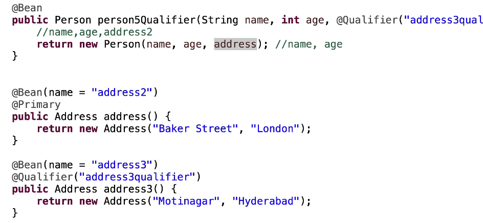

```java

package com.in28minutes.learnspringframework.helloworld;

import org.springframework.beans.factory.annotation.Qualifier;
import org.springframework.context.annotation.Bean;
import org.springframework.context.annotation.Configuration;
import org.springframework.context.annotation.Primary;

//Eliminate verbosity in creating Java Beans
//Public accessor methods, constructor, 
//equals, hashcode and toString are automatically created. 
//Released in JDK 16.

record Person (String name, int age, Address address) { };

//Address - firstLine & city
record Address(String firstLine, String city){ };

@Configuration
public class HelloWorldConfiguration {
	
	@Bean
	public String name() {
		return "Ranga";
	}
	
	@Bean
	public int age() {
		return 15;
	}
	
	@Bean
	public Person person() {
		return new Person("Ravi", 20, new Address("Main Street", "Utrecht"));		
	}

	@Bean
	public Person person2MethodCall() {
		return new Person(name(), age(), address()); //name, age		
	}

	@Bean
	public Person person3Parameters(String name, int age, Address address3) {
		//name,age,address2
		return new Person(name, age, address3); //name, age		
	}

	@Bean
	@Primary
	//No qualifying bean of type 'com.in28minutes.learnspringframework.Address' 
	//available: expected single matching bean but found 2: address2,address3
	public Person person4Parameters(String name, int age, Address address) {
		//name,age,address2
		return new Person(name, age, address); //name, age		
	}

	@Bean
	public Person person5Qualifier(String name, int age, @Qualifier("address3qualifier") Address address) {
		//name,age,address2
		return new Person(name, age, address); //name, age		
	}

	
	@Bean(name = "address2")
	@Primary
	public Address address() {
		return new Address("Baker Street", "London");		
	}

	@Bean(name = "address3")
	@Qualifier("address3qualifier")
	public Address address3() {
		return new Address("Motinagar", "Hyderabad");		
	}

}

```
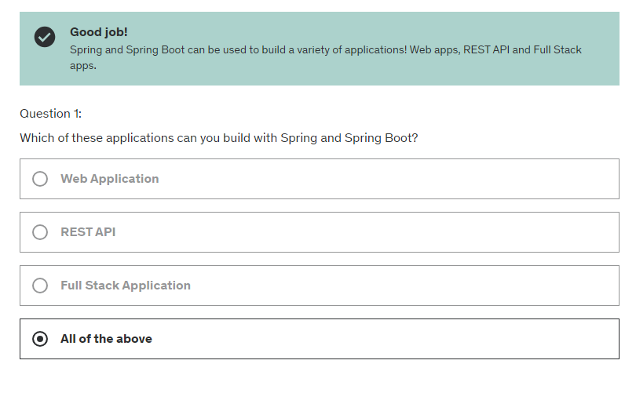

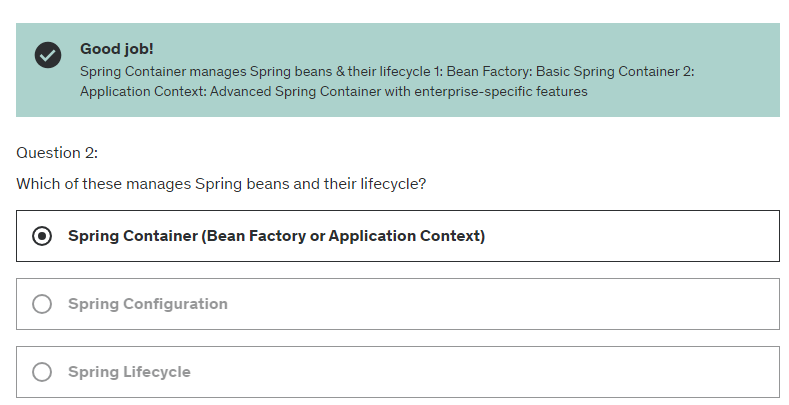

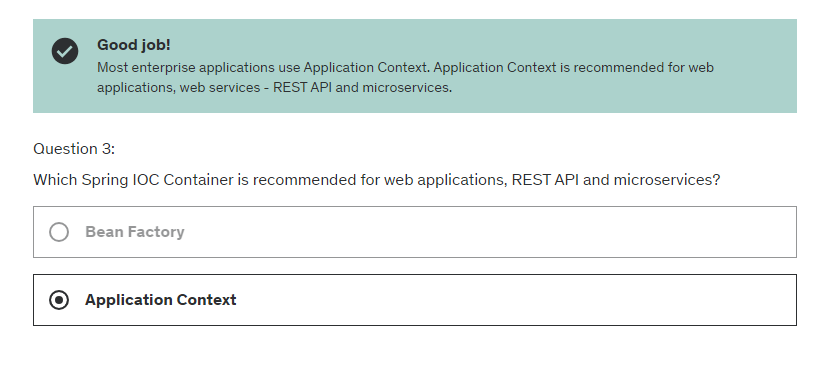

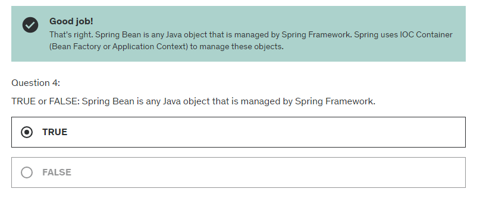

## 26
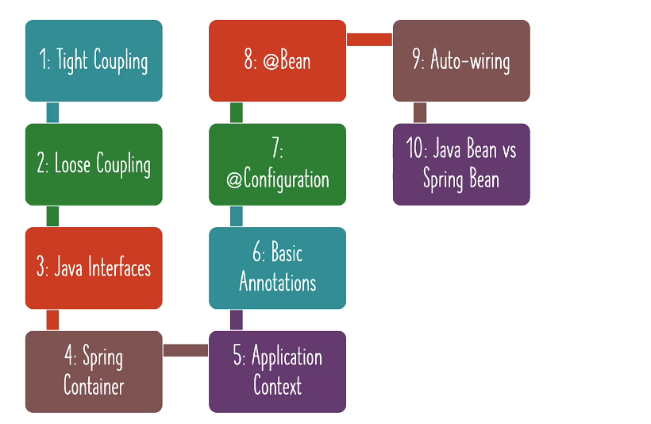
lets explore below
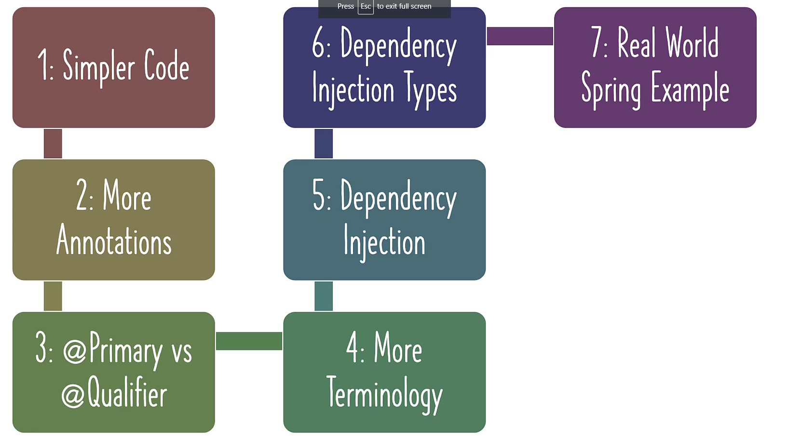

# Section 3 : using sfw create and manage the java objects.

## 30. Step 02 - Exploring Primary and Qualifier Annotations for Spring Components

@Component on MarioGame
so to stop conflict
then use @Primary on one of the beans

## 31. Step 03 - Primary and Qualifier - Which Spring Annotation Should You Use?


if @Qualifier is not given to the bean
but you can call it by the name of the bean of it's class name in small letter of first letter.
```java

@Qualifier("r") //for RadixSorting bean
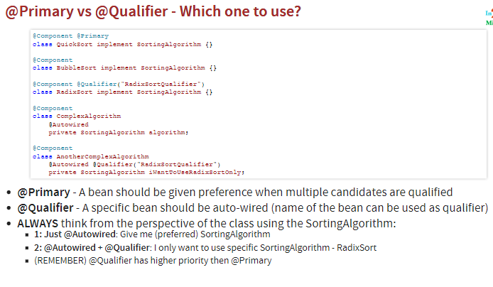

## 32 Step 04 - Exploring Spring Framework - Different Types of Dependency Injection

Autowired is not required for constructor injection


## 38
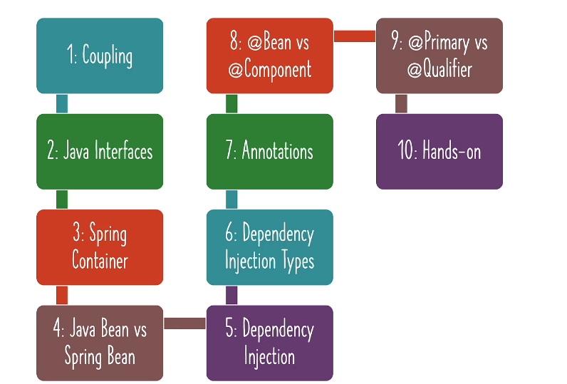


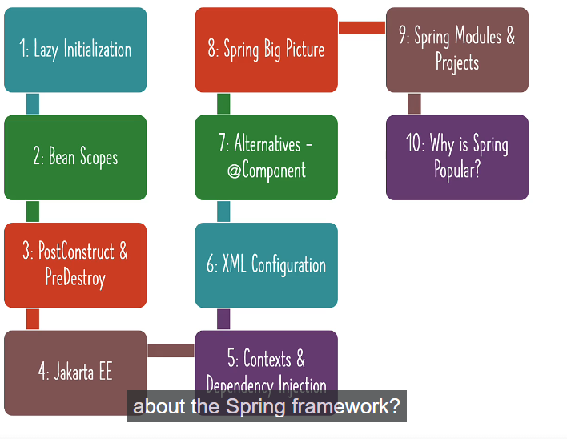

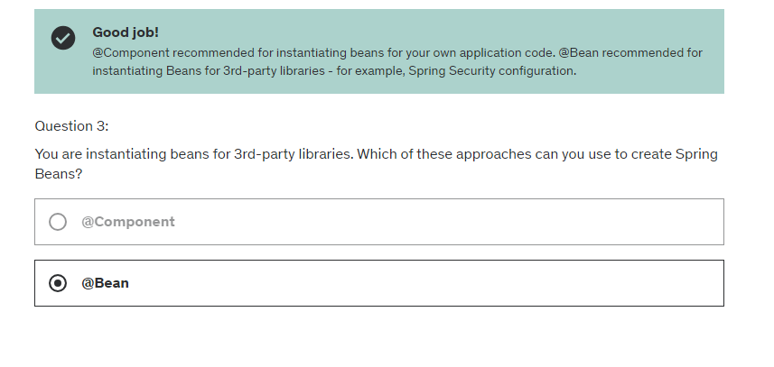

## 39. How to remember for long time, is consistency ?
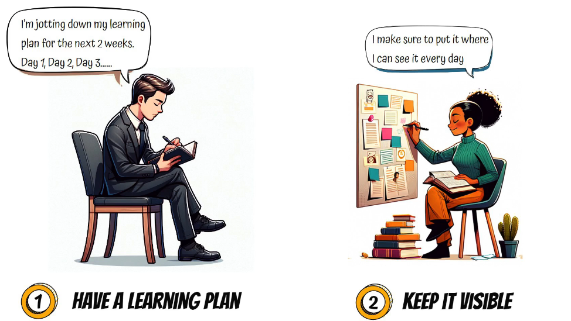


# Section 4 : Advanced Concepts in Spring Framework

## 41. Exploring Lazy and Eager Initialization of Spring Framework Beans

Lazy is something you would not need to use frequently,

but if you have a lot

of complex initialization logic and if you don't

want it to delay this tied up,

in those kind of situations,

you can think about lazy initialization of Spring Beans.

However, it is very, very important to remember

that if you're making use of lazy initialization errors

in spring configuration will not be discovered

at application startup.

They will become runtime errors.

## 42. 


+++++++++++++++++++
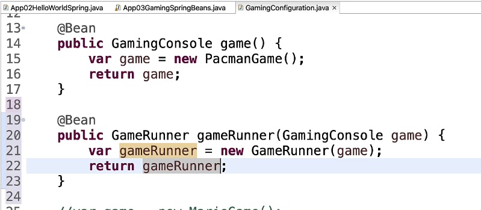

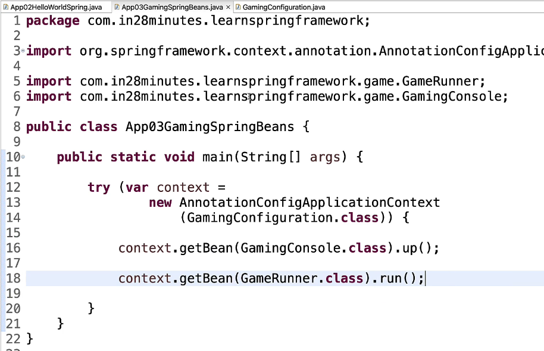


# Section 7 : Build Java Web Application with Spring Framework, Spring Boot and Hibernate


## 139 